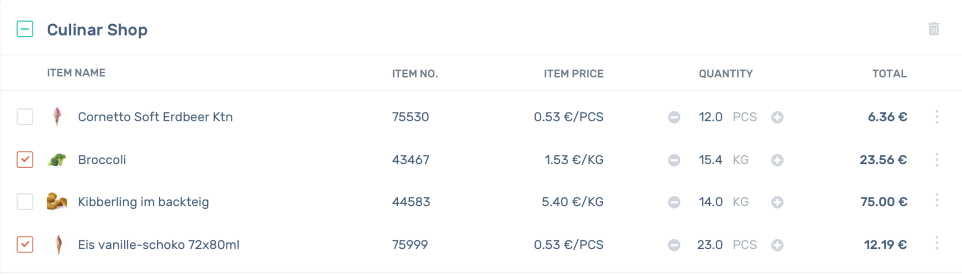
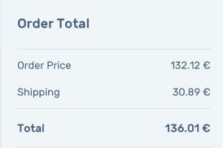

# Frontend Test

- Add a Table to list products and theirs prices(You don't need to implement Item Number and Quantity).
- When I select a product, it should be added to the cart and update the total value of the cart(You don't need to implement shipping).

- When I add a product to the cart it should be removed from the product's table.
- When I remove a product from the cart it should be re-added to the product's table.
